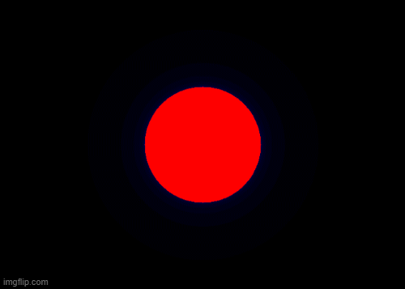

# Julia Skup

Julia Skup implementiran u GCLC. Jednostavnom promenom parametara je moguće dobiti različite oblike i paterne.
### Formula
Z = Z^2 + C \
Z - kompleksan broj (početna vrednost za svaku tačku su njene koordinate na kompleksnoj ravni). \
C - konstanta od koje zavisi patern Julia skupa.
### Korišćenje
Konačan izgled slike zavisi od nekoliko parametara: \
korak - koliko tačaka će činiti sliku (Upozorenje - biti pažljiv sa veoma malim vrednostima (ispod 0,01)) \
real i imaginary - Realan i imaginaran deo konstante C (od njih zavisi izgled) \
maxiter - posle koliko iteracija kažemo da funkcija konvergira \
bail - ako funkcija pređe ovu vrednost onda divergira 

Za animacije pogledati kod u folderu animacija. U datom primeru konstanta C se menja i uzima vrednosti funkcije kardioida. Ovo se može zameniti drugom funkicijom da bi se dobila drugačija animacija.

### Primeri

*C se menja po funkciji kardioida*

*Real = -0.8, Imaginary = 0.156*

*Real = 0.355, Imaginary = 0.355*

